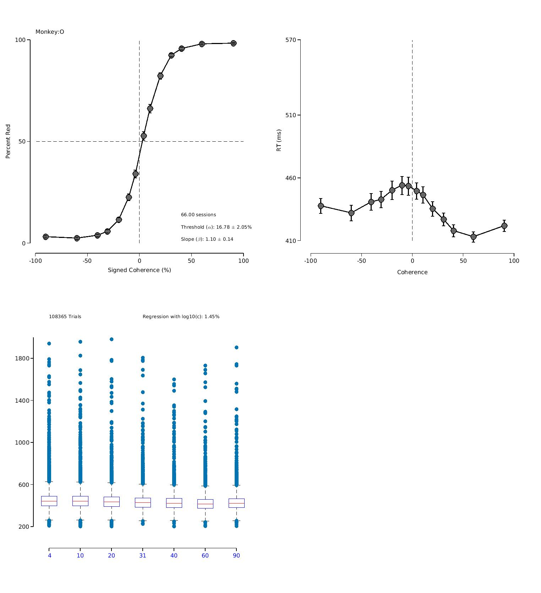

## Figure 2
### Psychometric curves for the monkey, and RT and box plots

Open 'plotFigure2.m'. 

Run this script to load behavioral data for both monkeys. Script then displays psychometric curves (percent responded red as a function of signed coherence), reaction time (RT) curves as a function of signed coherence, and boxplots of RTs organized by stimulus coherence for both monkeys. We also plot various statistics associated with the psychometric curves and the boxplot

Tiberius - Behavior

Olaf - Behavior 

